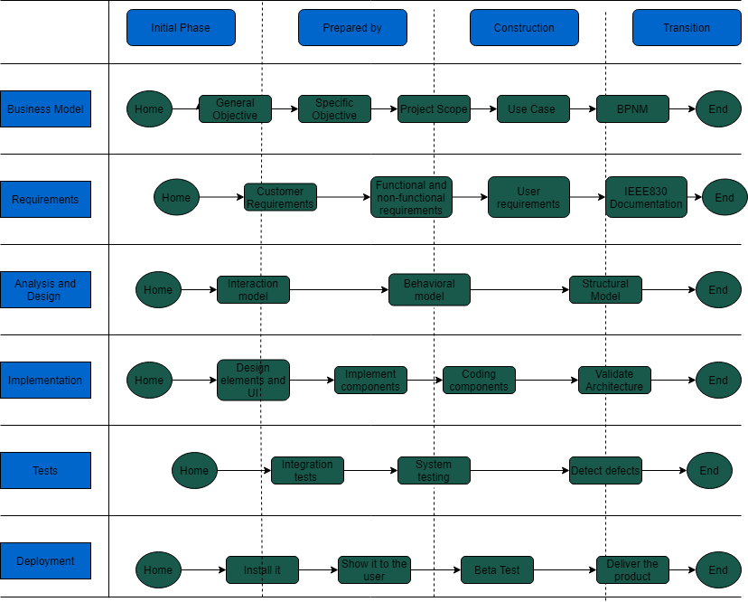

# Diagrama de flujo sobre el proceso de desarrollo

## :trophy: C0.3 Reto en clase

Proceso de desarrollo y flujo de trabajo de la metodología a seguir
___

## Instrucciones

- Basado en la información proporcionada, los videos observados y si es necesario realice una breve investigación sobre **el proceso de desarrollo y flujo de trabajo de la metodologia a seguir**.
- Toda actividad o reto se deberá realizar utilizando el estilo **MarkDown con extension .md** y el entorno de desarrollo VSCode, debiendo ser elaborado como un documento **single page**, es decir si el documento cuanta con imágenes, enlaces o cualquier documento externo debe ser accedido desde etiquetas y enlaces.
- Es requisito que el archivo .md contenga una etiqueta del enlace al repositorio de su documento en Github, por ejemplo **Enlace a mi GitHub**
- Al concluir el reto el reto se deberá subir a github el archivo .md creado.
- Desde el archivo **.md** se debe exportar un archivo **.pdf** con la nomenclatura **C0.3_NombredelaActividad_NombreAlumno.pdf**, el cual deberá subirse a classroom dentro de su apartado correspondiente, para que sirva como evidencia de su entrega; siendo esta plataforma **oficial** aquí se recibirá la calificación de su actividad por individual.
- Considerando que el archivo .pdf, fue obtenido desde archivo .md, ambos deben ser idénticos y mostrar el mismo contenido.
- Su repositorio ademas de que debe contar con un archivo **readme**.md dentro de su directorio raíz, con la información como datos del estudiante, equipo de trabajo, materia, carrera, datos del asesor, e incluso logotipo o imágenes, debe tener un apartado de contenidos o indice, los cuales realmente son ligas o **enlaces a sus documentos .md**, _evite utilizar texto_ para indicar enlaces internos o externo.
- Se propone una estructura tal como esta indicada abajo, sin embargo puede utilizarse cualquier otra que le apoye para organizar su repositorio.

```
| readme.md
| | blog
| | | Cx.1_NombredelaActividad.md
| | | Ax.1_NombredelaActividad.md
| | diagrams
| | docs
| | html
| | img
| | pdf    
```
___

## :pencil2:  Desarrollo

1. Instale la extension Draw.io integration dentro de visual studio code y elabore el diagrama solicitado, bajo la metodología que se esta planteando

    - :arrow_forward: [Extension de visual studio code - Draw.io integration](https://www.youtube.com/watch?v=Y47ZlxoDWNI)
    - Ejemplo de un diagrama de flujo utilizando Draw.io: 

        

2. Elabore el diagrama de flujo que contenga la secuencia de bloques que se tendría que seguir durante un desarrollo de software, bajo esta metodología.
# Metodología RUP
• El eje horizontal representa tiempo y demuestra los aspectos del ciclo de vida
del proceso.
• El eje vertical representa las disciplinas, que agrupan actividades definidas
lógicamente por la naturaleza.


___

### :bomb: Rubrica

| Criterios     | Descripción                                                                                  | Puntaje |
| ------------- | -------------------------------------------------------------------------------------------- | ------- |
| Instrucciones | Se cumple con cada uno de los puntos indicados dentro del apartado Instrucciones?            | 20 |
| Desarrollo    | Se respondió a cada uno de los puntos solicitados dentro del desarrollo de la actividad?     | 80      |


:house: [Ir a inicio](../docs/D0.1_Introduccion_IngenieriaSoftware.md)