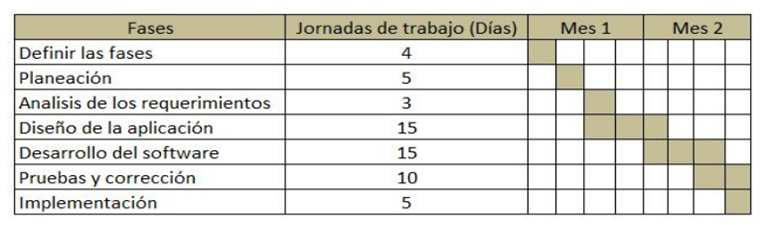
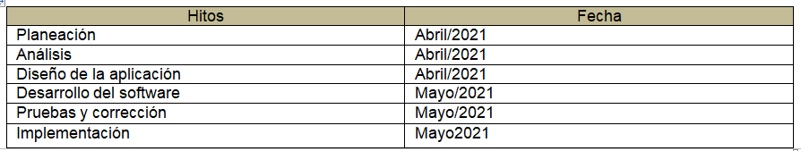
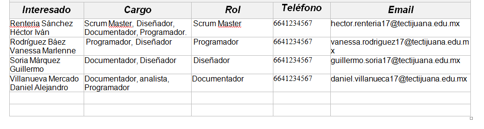
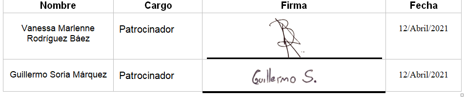

# Inicio del proyecto

## :trophy: C1.2 Reto en clase

Elaboracion del acta constitutiva del proyecto

### :blue_book: Instrucciones

- De acuerdo con la información presentada por el asesor referente al tema, y basado en el caso de estudio, realizar el acta constitutiva del proyecto basado en el ejemplo [documento acta constitución del proyecto](../pdf/C1.2_Ejemplo_ActaConstitución_delProyecto.pdf) indicada por el asesor
- Toda actividad o reto se deberá realizar utilizando el estilo **MarkDown con extension .md** y el entorno de desarrollo VSCode, debiendo ser elaborado como un documento **single page**, es decir si el documento cuanta con imágenes, enlaces o cualquier documento externo debe ser accedido desde etiquetas y enlaces.
- Es requisito que el archivo .md contenga una etiqueta del enlace al repositorio de su documento en Github, por ejemplo **Enlace a mi GitHub**
- Al concluir el reto el reto se deberá subir a github el archivo .md creado.
- Desde el archivo **.md** se debe exportar un archivo **.pdf** con la nomenclatura **C1.2_NombredelaActividad_NombreAlumno.pdf**, el cual deberá subirse a classroom dentro de su apartado correspondiente, para que sirva como evidencia de su entrega; siendo esta plataforma **oficial** aquí se recibirá la calificación de su actividad por individual.
- Considerando que el archivo .pdf, fue obtenido desde archivo .md, ambos deben ser idénticos y mostrar el mismo contenido.
- Su repositorio ademas de que debe contar con un archivo **readme**.md dentro de su directorio raíz, con la información como datos del estudiante, equipo de trabajo, materia, carrera, datos del asesor, e incluso logotipo o imágenes, debe tener un apartado de contenidos o indice, los cuales realmente son ligas o **enlaces a sus documentos .md**, _evite utilizar texto_ para indicar enlaces internos o externo.
- Se propone una estructura tal como esta indicada abajo, sin embargo puede utilizarse cualquier otra que le apoye para organizar su repositorio.

```
| readme.md
| | blog
| | | Cx.1_NombredelaActividad.md
| | | Ax.1_NombredelaActividad.md
| | diagrams
| | docs
| | html
| | img
| | pdf    
```
___

## :pencil2: Desarrollo

1. Elabore el documento que se anexa en las instrucciones referente al acta constitutiva al estilo markdown, dentro del entorno de visual studio code.
2. Redacte el acta constitutiva elaborada y registrada con los datos solicitados.


## Acta de Constitución de Proyecto

|**Empresa:**    | Mark Rock  | 
| ------------- | -------------------------------------------------------------------------------------------- | 
| **Nombre del proyecto:** |Búsqueda del conocimiento                                                          | 
| **Tipo de proyecto:** | Sistema de gestion de conocimiento (KMS) |
| **Patrocinador:** | Zerox|
| **Dueño del producto:** | The vid of knowledge|
| **Gerente del producto:** | Daniel Alejandro Villanueva  Mercado |
| **Scrum Master:** | Héctor Iván Renteria Sánchez|


|**Propósito del Documento**   |
| --------------------------------------------------------------------------------------------  |
|Este documento define la descripción general, los objetivos y los participantes del proyecto. Se relaciona principalmente con la autorización del inicio del proyecto. Asimismo este documento brinda una descripción de la situación actual, los requisitos de alto nivel, criterios de éxito, riegos y oportunidades.|


|**Propósito/ Justificación**   |   
| --------------------------------------------------------------------------------------------  |
|La empresa “The vid of knowledge” ofrece herramientas tecnológicas basadas en la administración del conocimiento por lo cual desean desarrollar una plataforma en línea con un buen nivel de calidad para entrase en el mundo de la búsqueda del conocimiento en línea ya que se ha visto afectado por la competencia en los últimos años por lo que desea ofrecer sus herramientas a sus usuarios.|


|**Breve descripción del proyecto**   |   
| --------------------------------------------------------------------------------------------  | 
|Se realizara una plataforma en la cual se pueda ver, modificar y descargar un tópico así como poder subir un tópico, contara con títulos relacionados para poder complementar la búsqueda, cada usuario tendrá su menú personalizado y podrá guardar tópicos que le interesen.|


|**Alcance preliminar del proyecto**   |   
| --------------------------------------------------------------------------------------------  | 
|**Objetivo General:**  *Incrementar el negocio de administración y conversacion del conocimiento mediante una plataforma donde permita obtener mayores ganancias y estar siempre al alcance de cualquier persona.*|
|**Objetivos Especificos:** |
|Incrementar el contenido de tópicos un 20% para tener diversidad de contenido en un periodo de 5 meses| 
|Capturar un 70% de personal de la empresa en un lapso de 3 meses*|
|Implementar actualizaciones que incrementen el contenido de los tópicos en un periodo de 1 año.*|


|**Resultados esperados del proyecto / Beneficios**   |   
| --------------------------------------------------------------------------------------------  | 
| Poder subir un tópico, Poder mostrar tópicos relacionados al título de búsqueda|
|Poder descargar, Poder ver videos o imágenes|
|Tener una lista de tópicos que deseen leer después.|


|**Requisitos de alto nivel del proyecto:**   |  | 
| ------------- | -------------------------------------------------------------------------------------------- | 
|**Requisito**|**Criterio de Éxito**|
|Ofrecer a los usuarios una plataforma que esté disponible en todo momento, que sea fácil de utilizar y atractiva, así como garantice seguridad de la información que ahí se registre.|Tener un buen diseño el cual no sea muy difícil de entender, al igual de tener un buen servidor para que esté disponible en todo momento|
|Al redactar un usuario un tópico, se le ofrecerá un catalogo con tópicos relacionados y existentes.| Tener una base de datos la cual despliegue títulos relacionados a la búsqueda.|
|Permitir que a los tópicos que se publiquen puedan además anexar fotos, videos o presentaciones con un límite máximo de tamaño y duración.| No tener restricción en el tipo de formato al momento de subir|
|Ofrecer al usuario el poder consultar los tópicos que se ha registrado así como el poder bajar localmente los documentos referenciados.|Lograr que el usuario descargue los tópicos ya sean videos o imágenes.|


|**Hitos**   |   
| --------------------------------------------------------------------------------------------  | 
|En base a la información disponible y al alcance definido, se estima una dedicación de esfuerzo de 57 días|
|En base a nuestra experiencia y la disponibilidad y agenda del personal del cliente, se estima una duración total del proyecto de 11-13 semanas|
|Para asegurar el cumplimiento de los objetivos del proyecto, éste se abordará mediante 7 fases, presentadas a continuación.|
|
| •	Los principales hitos del proyecto se encuentran resumidos en la tabla siguiente: 
|


|**Riesgos**   |   
|--------------------------------------------------------------------------------------------  | 
| *Alto impacto:* Que el usuario no sepa como subir un típico, Que el software sea difícil de comprender, El tiempo para ver un tópico sea mucho, Que no se conecte de forma adecuada la base de datos. 
*Mediano impacto:* El diseño no sea lo esperado, Los colores para el diseño no sean los adecuados,Atrasos por días festivos.|


|**Costo Preliminar Estimado / Presupuesto**   |   
| --------------------------------------------------------------------------------------------  | 
|•	Planeación………………………………………………………..$6,000|
|•	Análisis de los requerimientos………………………………….$4,000|
|•	Diseño de la aplicación………………………………………….$12,000|
|•	Desarrollo del software………………………………………….$30,000|
•	Pruebas y corrección…………………………………………….$12,000|
|•	Implementación…………………………………………………..$4,500|
|•	Total……………………………………………………………….$68,500|


|**Interesados en el proyecto**   | 
|--------------------------------------------------------------------------------------------  | 
| |


|**Supuestos**   | 
| --------------------------------------------------------------------------------------------  | 
| Participación del departamento de diseño.|
|programación y documentación, El cliente nos debe de autorizar el diseño.|


|**Restricciones**   | 
|-------------------------------------------------------------------------------------------- |
|Se necesita un buscador para ingresar en una computadora.|
|Se necesita de un celular para poder acceder a la plataforma.|
|Se necesita un usuario.|
|Se debe de validar el típico antes de subirlo.|


|**Autorización de proyecto**   | 
| --------------------------------------------------------------------------------------------  | 
| |
___

### :bomb: Rubrica

| Criterios     | Descripción                                                                                  | Puntaje |
| ------------- | -------------------------------------------------------------------------------------------- | ------- |
| Instrucciones | Se cumple con cada uno de los puntos indicados dentro del apartado Instrucciones?            | 20 |
| Desarrollo    | Se respondió a cada uno de los puntos solicitados dentro del desarrollo de la actividad?     | 80      |


:house: [Link Rodríguez Báez Vanessa Marlenne](https://github.com/vanessamRodriguez/Analisis-Avanzado-de-Software)