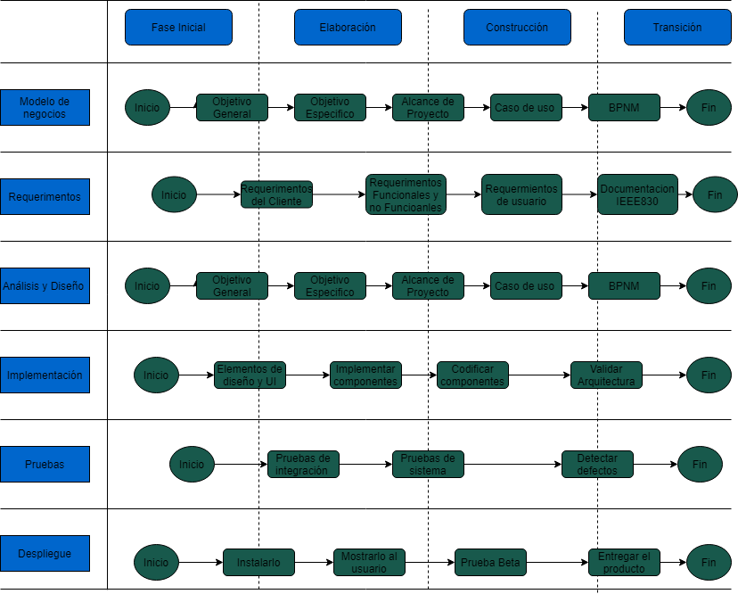
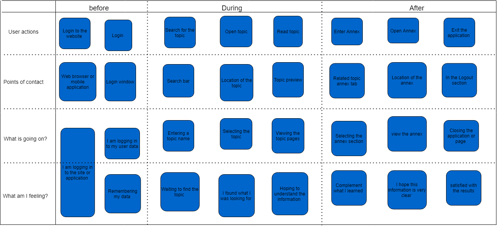

# Introducción

## :trophy: A0.1 Learning activity

## Target
Conduct the context of the case study, as well as a field interview, and finally consolidate the requirements information, using the empathizing phase proposed by design thinking requirements information, using the empathize phase proposed by design thinking.

### :blue_book: Instructions

- Based on the information provided by the advisor on the topic of design thinking, empathize phase, carry out the activity indicated in the development section, and if necessary carry out a brief investigation on **tools to collect information for the analysis of customer requirements**.

- Any activity or challenge must be carried out using the **MarkDown style with .md** extension and the VSCode development environment, and must be prepared as a **single page** document, that is, if the document has images, links or Any external document must be accessed from tags and links, and must be named with the nomenclature **A0.1_ActivityName_StudentName.pdf.**
- It is a requirement that the .MD contains a tag of the link to the repository of your document in GITHUB, for example **Link to my GitHub** and at the end of the challenge it should be uploaded to github.
- From the **.Md** file, export a **.Pdf** file that must be uploaded to classroom within its corresponding section, serving as evidence of its delivery, since being the **official** platform, the rating of your activity.
- Considering that the .PDF file, which was obtained from the .MD file, both must be identical.
- Your repository in addition to having a **readme.Md** file in your root directory, with information such as student data, work team, subject, career, advisor data, and even logo or images, it must have a section of contents or index, which really are links or **links to your .md documents**, _avoid using text_ to indicate internal or external links.
- A structure is proposed as indicated below, however any other that supports you can be used to organize your repository.

```
| readme.md
| | blog
| | | Cx.1_Nameoftheactivity.md
| | | Ax.1_Nameoftheactivity.md
| | diagrams
| | docs
| | html
| | img
| | pdf    
```

___

## :pencil2:  Development
1. Taking as a basis the characteristics referred to in the  ase study and the design thinking proposal, elaborate context, a list of at least **15 questions directed to the client**, such that they can give you more detailed information to elaborate the analysis of the requirements on the case study.
   
## Diagram


## Questions

1.-  **On what platform would you like the application to be developed (website or app)?**
           Web and mobile.

2.- **Do you have a preference for any specific color or design?**
        Company colors (blue and white)

3.-**Would you be interested in accepting other types of formats other than PDF such as docx, txt?**
PPT, PDF, DOCX, mp4

4.- **Will related topics be shown even if the search is successful?**
Yes, to complement the information found 

5.- **Will it have links that allow to go to other pages to complement with other type of sources?**
If it is expected to have links so that it is a way of complementing 

6.-**Will the annexes be directly related to the topic or to the category of the topic?**
Only with the searched topic

7.- **Will only a limit of images be allowed?**
There will be no limit. 

8.- **What search options do you want for the program?**
Title, document rating and date

9.- **Will the searches performed be saved?**
Yes, you have a search history

10.- **Will any type of user be accepted or only from the company?**
Only company users.

11.- **Will a cover of the file be shown?**
Yes, in order to better identify it 

12.- **Will it have the option to download files?**
Yes, the idea is that any user of the company can access this information.

13.-**Will related results be displayed by category or by name match?**
By topic, but show that you did not find the requested topic.

14.- **What types of categories will be included in the application?**
       Any type of subject (different departments) 

15.- **Will any user be allowed to upload files or only a specific group?**
        Certain group (Level that generates the courses)


2.  Once the interview indicated in the previous point has been carried out, use any of the techniques that are proposed within the empathize phase of design thinking, and you can even use any other tool, technique or artifact to consolidate the information collected through the client and elaborate your **proposal of the business model of the system to be developed**.

# customer Journey

We chose this tool because it is more visual to see each part of the project and it was more adapted to our needs, as we know the experience map details in a visual and schematic way the project. It is easier to imagine each step of the process, it is based on 3 phases: what do you do, what do you think and what do you feel.  




3.  Prepare and expose your document, considering doing the dynamics as you would do a job in the field or client site, and present it to the advisor and your classmates.

## conclusions
___
- **Renteria Sanchez Hector Ivan:** During the performance of this work we had problems when formulating the questions in a way in which the necessary information was obtained from the client, as a team we were able to correct some questions and we began to make the experience map based on the information obtained, In this phase we had some confusion to make the map due to the way in which to write it, exchanging ideas we reached a middle ground so that the phases of the map were understood, personally I think that the ideas that each team member had were scattered at the beginning, but by exchanging each one of them we managed to better understand the activity.
- **Rodríguez Báez Vanessa Marlenne:** During the development of this practice we touched on the topic of desing thinking which with the use of its tools we managed to reach a result on the information of the 15 questions we did as a team on our case study, we did not have a very clear idea of the case but once with the answers we knew well what to do, when selecting the tool we had a problem because we did not choose the one that best suited our case and we had problems, once we used the experience map tool (customer Journey) it made it much easier to continue with the activity and understand the desing thinking.

- **Soria Márquez Guillermo:**
- **Villanueva Mercado Daniel Alejandro:** The use of tools is a somewhat complicated issue, since you must first analyze which tools are best suited to the case study you are analyzing. The problem comes when you choose one and at a certain point you realize that many aspects are repeated in that tool, as we realized when using the What, How and Why tools, since in the Why part we realized that many things could be repeated in meaning even if the context was different, so after reanalyzing the tools we used the user experience tool, which turned out to be better adapted to what we had in mind.


### :bomb: Rubric

|criteria     | Description                                                                                  | Score|
| ------------- | -------------------------------------------------------------------------------------------- | ------- |
| Instructions | Is each of the points indicated in the Instructions section fulfilled?        | 10      |  | 5 |
| Development    | Was each one of the points requested within the development of the activity answered?     | 60      |
| Demonstration  | Does the student introduce himself during the explanation of the functionality of the activity?           | 20      |
| Conclusions  | Is a personal opinion of the activity included by each of the team members? | 10      |

:house: [Link Renteria Sanchez Hector Ivan](https://github.com/IvanRenteria/Analisis-Avanzado-de-Software)
:house: [Link Rodríguez Báez Vanessa Marlenne](https://github.com/vanessamRodriguez/Analisis-Avanzado-de-Software)
:house: [Link Soria Márquez Guillermo](https://github.com/GuillermoSoria97/Analisis_Avanzado_de_Software)
:house: [Link Villanueva Mercado Daniel Alejandro](https://github.com/Dany305/Analisis-Avanzado-de-Software)