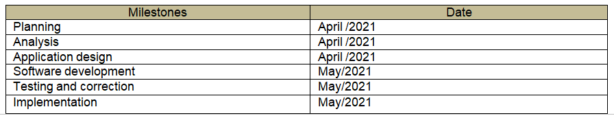
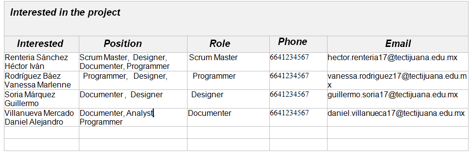

# Project start

## :trophy: A1.0 Learning Activity

Elaboration of the project charter

### :blue_book: Instructions

- According to the information presented by the consultant regarding the subject, and based on the case study, create the project charter based on the example [document of the project's constitution](../artefactos/ActaConstitución_delProyecto_Rev3.0.pdf) indicated by the consultant
- Every activity or challenge must be done using the **MarkDown style with .md** extension and the VSCode development environment, and must be elaborated as a **single page** document, that is to say, if the document has images, links or any external document it must be accessed from tags and links.
- It is required that the .md file contains a link tag to the repository of your document on Github, for example **Link to my GitHub**.
- At the end of the challenge the created .md file must be uploaded to github.
- From the **.md** file a **.pdf** file with the **A1 nomenclature must be exported0_NombredelaActividad_NombreAlumno.pdf**, which must be uploaded to the classroom in its corresponding section, to serve as evidence of its delivery; being this **official** platform, here you will receive the grade of your individual activity.
- Considering that the .pdf file was obtained from the .md file, both must be identical and show the same content.
- Your repository, besides having a **readme**.md file in its root directory, with information such as student data, work team, subject, career, advisor data, and even logo or images, must have a contents section or index, which are actually links or **links to your .md** documents, _avoid using text_ to indicate internal or external links.
- The proposed structure is as shown below, but you can use any other structure to help you organize your repository.

```
| readme.md
| | blog
| | | Cx.1_NameofActivity.md
| | | Ax.1_NameofActivity.md
| | diagrams
| | docs
| | html
| | img
| | pdf    
```
___

## :pencil2: Development

1. Prepare the document attached in the instructions regarding the articles of incorporation.
2. Enter the data indicated in each of the sections of the articles of incorporation for the case study.

## Project Constitution Act

|**Business:**    | Mark Rock  | 
| ------------- | -------------------------------------------------------------------------------------------- | 
| **Project's name:** |Quest for knowledge. | 
| **Project Type:** | web and mobile.|
| **Sponsor:** | Zerox.|
| **Product owner:** | The vid of knowledge.|
| **Product manager:** | Daniel Alejandro Villanueva  Mercado. |
| **Scrum Master:** | Héctor Iván Renteria Sánchez.|


|**Purpose of the document**   |
| --------------------------------------------------------------------------------------------  |
|This document defines the general description, objectives and participants of the project. It is mainly related to the document also provides a description of the current situation, the requirements of the project and the It also provides a description of the current situation, requirements, success criteria, risks and opportunities.|


|**Purpose/ Justification**   |   
| --------------------------------------------------------------------------------------------  |
|The company "The vid of knowledge" offers technological tools based on knowledge management, so they want to develop an online platform with a good level of quality to enter the world of online knowledge search, the world of the search of knowledge online since it has been affected by the competition in the last years, competition in the last years so they want to offer their tools to their users.|


|**Brief description of the project**   |   
| --------------------------------------------------------------------------------------------  | 
|A platform will be created in which it will be possible to view, modify and download a topic as well as to upload a topic, related titles to complement the search, each user will have a personalized menu and will be able to save topics that interest him/her, personalized menu and will be able to save topics that interest him/her.|


|**Preliminary project scope**   |   
| --------------------------------------------------------------------------------------------  | 
|**General Objective:** |
|To increase the knowledge management and conversation business through a platform that allows to obtain, to increase the business of knowledge management and conversation through a platform where it allows to obtain profits and be always available to anyone.and to be always available to anyone.
|**Specific Objectives:** |
|To increase the content of topics by 20% to have a diversity of content in a period of 5 months.| 
|To recruit 70% of the company's staff within a 3 month period.|
|Implement updates that increase the content of the topics within a period of 1 year.|


|**Expected results of the project / Benefits:**   |   
| --------------------------------------------------------------------------------------------  | 
|Power to upload a topic|
|Power to display topics related to the search title|
|Power to download|
|View videos or images|
|Have a list of topics that you want to read later |

|**High level project requirements:**   |  |
| ------------- | -------------------------------------------------------------------------------------------- |
|**Requirement**|**Success Criteria**|
|Offer users a platform that is available at all times, that is easy to use and attractive, as well as guaranteeing the security of the information registered there.|Have a good design which is not very difficult to understand have a good server so that it is available at all times.|
|When a user enters a topic, he/she will be offered a catalog with related and existing topics.|which displays titles related to the search.|
|To allow that to the topics that are published they can also attach photos, videos or presentations with a maximum duration limit.| No restriction on the type of format at the time of uploading.|
|Offer the user the ability to consult the topics that have been registered as well as the ability to download the referenced documents locally.|To make the user download the topics, whether they are videos or images.|
|Offer data analytics on the topics that are most popular, the topics to which users do not find similar topics, using recommendations or solutions made by the system itself.similar topics, using the recommendations or solutions made by the system itself. On the home page a top 10 of the most searched topics should be shown. |The home page should show a top 10 of the most searched topics. As well as a list of the topics that are not found in the system. |


|**Milestones**   |   
| --------------------------------------------------------------------------------------------  | 
|Based on the available information and the defined scope, we estimate an effort dedication of 57 days.|
|Based on our experience and the availability and schedule of the client's personnel, the total duration of the project is estimated at 11-13 weeks|
| The main milestones of the project are summarized in the table below: 
|


|**Risks**   |   
|--------------------------------------------------------------------------------------------  | 
|*High impact*|
|The user does not know how to upload a typical file.|
|The software is difficult to understand.|
|The topic takes too long to load.|
|Not knowing how to use a computer.|
|Not being able to connect the database properly.| 
|*Medium impact*|
|The design is not as expected.|
|The colors for the design are not appropriate.|
|Delays due to holidays.|


|**Preliminary Estimated Cost / Budget**   |   
| --------------------------------------------------------------------------------------------  | 
|Planning.......................................................................$6,000|
|Requirements analysis.....................................$4,000|
|Application design................................................$20,000|
|Software development...............................................$50,000|
|Testing and proofreading...................................................$15,000|
|Implementation...........................................................$6,000|
|Total...............................................................................$101,000|


|**Interested in the project**   | 
|--------------------------------------------------------------------------------------------  | 
| |


|**Assumptions**   | 
| --------------------------------------------------------------------------------------------  | 
|Users will be able to search for the topic they need.|
|Each topic will have its corresponding attachments. |
|If a topic is not found, a related topic will be displayed.|
|If a topic is not found, it can be requested to be included later.|
|You must be able to view videos, presentations and images.|
|You must be able to download the topic. |
|Each topic must have links to pages related to the same topic.|
|The topic must be viewable on the same page.|
|The page must be available at all times.|


|**Restrictions**   |
|-------------------------------------------------------------------------------------------- |
| Only employees of the company may enter.|
|Attachments should only contain videos, images and presentations.|
|Normal users will not be able to upload topics or attachments.|
|Only a few users will be able to upload topics and attachments.|
|Attachments will only be shown with their corresponding topic.|
|It will not be possible to register external users to the company. |
|Topics will only be searched by name.|


|**Project authorization**   |
| --------------------------------------------------------------------------------------------  | 
| .png)|
___
___
## conclusions 

*  **Renteria Sanchez Hector Ivan:** For this work, each point of all the work that we did individually for activity 1.2 had to be analyzed, thus we complemented the information and we managed to better understand the issues in which we had doubts, the part that complicated us the most as a team was the restrictions. After discussing it together, we corrected this point and wrote the restrictions that we consider correct.
  
*  **Rodríguez Báez Vanessa Marlenne:** Based on practice C1. 2 of the constitutive act that each one made, several sections of each one were taken in order to achieve a good constitutive act, we held a meeting among all and the documents were presented and thus be able to put the best information, our problem was to reach a agreement between all to be able to put the information since each one has a different point of view, with this practice we were able to better prepare a Constitutive Act as well as know what parts it contains, how to detail the importance of the project as well as understand what the client wants in the creation of it.
  
*  **Soria Márquez Guillermo:** At the time of creating the charter I had to investigate what each concept referred to because it was not clear to me what information was needed. I had some problems with the milestones because I did not understand the definition but in the end I ended up putting a date on the development of the software, I also modified the prices because at the beginning I considered that it was a very low cost. One of the points that complicated me the most were the assumptions because I did not understand what it referred to but after the teacher's explanation it was clearer. Other than those points I had no problem. In previous subjects I had already made a constitutive act but the truth is that I forgot some concepts, this practice helped me to reinforce them and to have more clear how it should be developed.

*  **Villanueva Mercado Daniel Alejandro:** In this activity, which is based on activity C1.2 that asked us to elaborate a project charter individually, but in this one all team members are required to participate by giving their point of view on each of the points of the charter. In this way, by discussing each of the points and giving our opinion, we were able to elaborate the document in the best way. Although there were some points in the document where we were a little lost, since we do not know if what we were putting was right.

### :bomb: Rubric

| Criteria     | Description                                                                                  | Score |
| ------------- | -------------------------------------------------------------------------------------------- | ------- |
| Instructions | Each of the points indicated in the section "The company complies with each one of the following points Instructions?            | 10      |  
| Development    | Each of the points requested in the development of the activity was answered.?     | 60      |
| Demonstration  | The student introduces himself during the explanation of the functionality of the activity.?            | 20      |
| Conclusions  | A personal opinion of the activity is included for each team member.? | 10      |


:house: [Link Renteria Sanchez Hector Ivan](https://github.com/IvanRenteria/Analisis-Avanzado-de-Software)

:house: [Link Rodríguez Báez Vanessa Marlenne](https://github.com/vanessamRodriguez/Analisis-Avanzado-de-Software)

:house: [Link Soria Márquez Guillermo](https://github.com/GuillermoSoria97/Analisis_Avanzado_de_Software)

:house: [Link Villanueva Mercado Daniel Alejandro](https://github.com/Dany305/Analisis-Avanzado-de-Software)