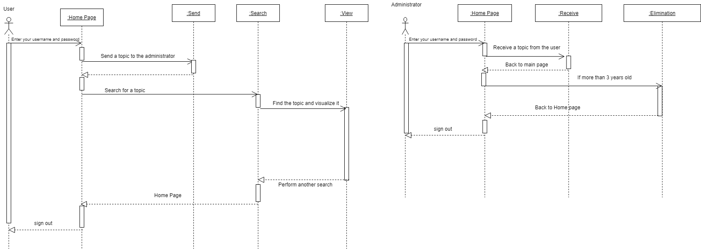
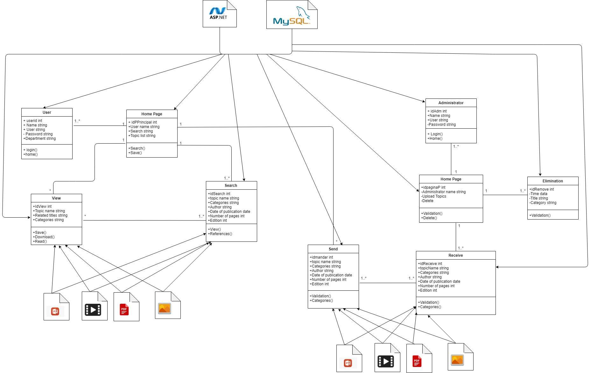

# Introduction

## :trophy: A1.1 Learning activity

Requirements modeling through UML diagrams

### :blue_book: Instructions

- Based on the document provided by the advisor and other sources of consultation, make the diagrams indicated in the development for the case study that has been reviewed during the course.
- Use the same tools from past challenges, such as drawio, or others that allow you to create diagrams or images that illustrate the concept.
- The team will explain what this type of diagram represents, what elements it consists of, as well as its interpretation within the case study.
- Any activity or challenge must be done using the **MarkDown style with .md** extension and the VSCode development environment, or you can use a platform such as **Notion**, and must be prepared as a **single page** document, i.e. if the document has images, links or any external document must be accessed from tags and links, and must be named with the nomenclature **A1.1_ActivityName_StudentName.pdf.**.
- It is required that the .MD contains a link tag to the repository of your document in GITHUB, for example **Link to my GitHub** and at the end of the challenge it must be uploaded to github.
- From the **.md** file, export a **.pdf** file that should be uploaded to the classroom in its corresponding section, serving as evidence of its delivery, since the **official** platform will receive the grade of your activity.
- Considering that the .PDF file, which was obtained from the .MD file, both must be identical.
- Your repository, besides having a **readme**.md file in its root directory, with information such as student data, work team, subject, career, advisor data, and even logo or images, must have a contents section or index, which are actually links or **links to your .md** documents, _avoid using text_ to indicate internal or external links.
- The proposed structure is as shown below, but you can use any other structure to help you organize your repository.

```
| readme.md
| | blog
| | | Cx.1_NameofActivity.md
| | | Ax.1_NameofActivity.md
| | diagrams
| | docs
| | html
| | img
| | pdf    
```
### :pencil2: Development

1. Based on each of the user and system requirements established above for the case study, draft the requested modeling diagrams:

+ A diagram containing the relationships between the different use cases, only for the scenario in which the user interacts with the system making use of the main or central functions according to each case study. (Include at least 5 diagram elements).
+ The **sequence** diagram explaining the communication between the different GUIs for the use cases of the previous point, considering that the user has already successfully logged into the system. (Include a minimum of 5 elements of the diagram).

+ The **class** diagrams for the objects to be instantiated, for the points mentioned above. (Include at least 5 diagram elements)


+ A package diagram containing the **component** diagrams and the relationships between the database, user interfaces, drivers or middleware layers. (Include at least 3 elements of the diagram)
+ The **distribution** diagrams representing the physical structure of the system such as physical infrastructure, networks, storage and web servers, firewall, mobile devices or any other physical resource that will be part of the system. (Include at least 3 elements of the diagram)

## Conclusiones 

* **Renteria Sanchez Hector Ivan:**
  
*  **Rodríguez Báez Vanessa Marlenne:** In this practice we used again the diagrams seen in the last 2 practices in our project, our problem was that in the team we had different points of view of how the program would be, we reached an agreement showing all the diagrams and combining them to achieve a better presentation, that was the only problem we had, I learned more about the diagrams and their understanding since in past semesters we had not seen them with so much detail and now I will be able to apply them in my next projects since I understood that planning it in detail is better than starting to program from the beginning and I hope that also in my working life.
  
*  **Soria Márquez Guillermo:**
*  **Villanueva Mercado Daniel Alejandro:**

### :bomb: Rubric

| Criteria     | Description                                                                                  | Score |
| ------------- | -------------------------------------------------------------------------------------------- | ------- |
| Instructions | Each of the points indicated in the Instructions section is complied with.?            | 10      |  
| Development    | Each of the points requested in the development of the activity was answered.?     | 60      |
| Demonstration  | The student introduces himself during the explanation of the functionality of the activity.?            | 20      |
| Conclusions  | A personal opinion of the activity is included for each team member.? | 10      |

:house: [Link Renteria Sanchez Hector Ivan](https://github.com/IvanRenteria/Analisis-Avanzado-de-Software)

:house: [Link Rodríguez Báez Vanessa Marlenne](https://github.com/vanessamRodriguez/Analisis-Avanzado-de-Software)

:house: [Link Soria Márquez Guillermo](https://github.com/GuillermoSoria97/Analisis_Avanzado_de_Software)

:house: [Link Villanueva Mercado Daniel Alejandro](https://github.com/Dany305/Analisis-Avanzado-de-Software)