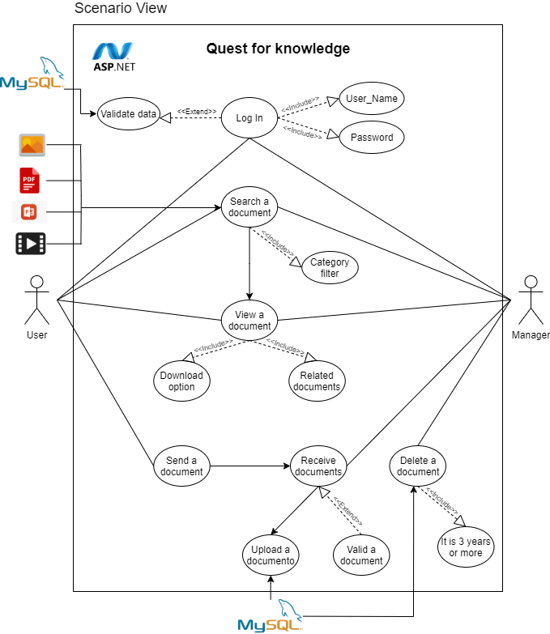
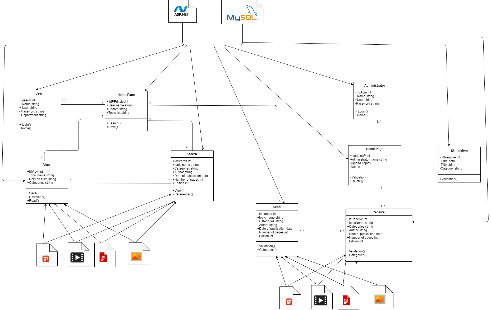
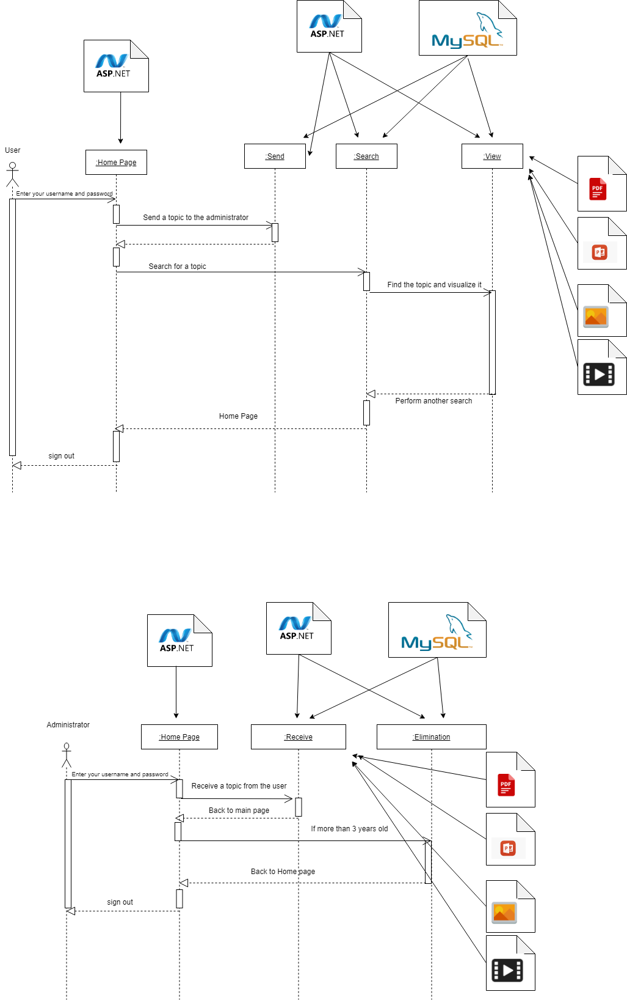
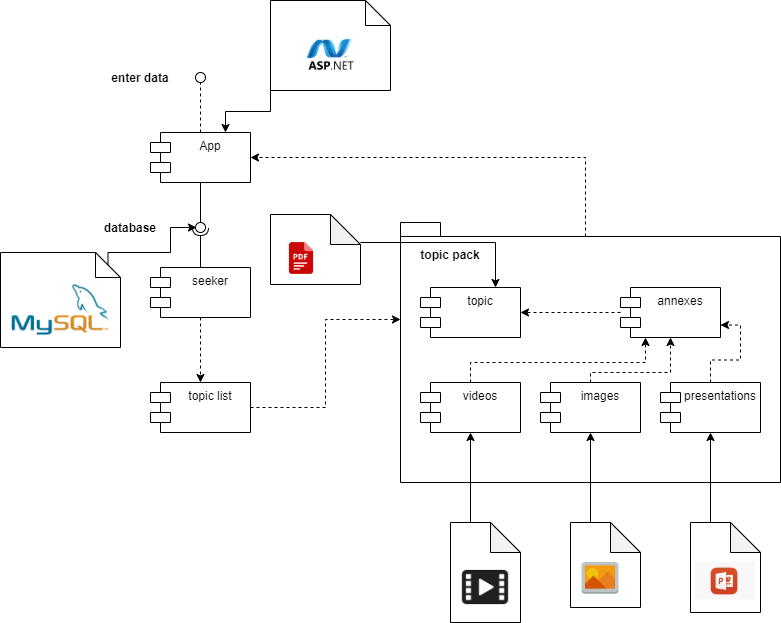
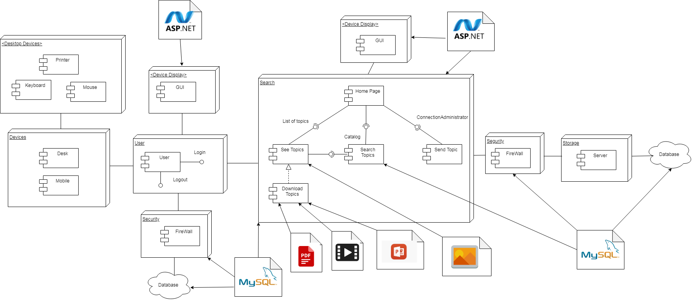

# Introduction

## :trophy: A2.2 Learning activity

- Documentation of system architecture based on 4+1 model

### :blue_book: Instructions

 - Based on the documentation provided by the consultant, develop diagrams that can be used to design the 4+1 model-based system architecture for the case study.
 - All activity or challenge must be done using the **MarkDown style with .md** extension and the VSCode development environment, or you can use any platform for example **Notion**, and it must be elaborated as a **single page** document, that is to say if the document has images, links or any external document it must be accessed from tags and links, and it must be named with the nomenclature **A2.2_ActivityName_StudentName.pdf.**.
- It is required that the .MD contains a tag of the link to the repository of your document in GITHUB, for example **Link to my GitHub** and at the conclusion of the challenge it should be uploaded to github.
- From the **.md** file export a **.pdf** file that should be uploaded to classroom within its corresponding section, serving as evidence of your delivery, since being the **official** platform here you will receive the qualification of your activity.
- Considering that the .PDF file, which was obtained from the .MD file, both must be identical.
- Your repository, in addition to having a **readme**.md file in its root directory, with information such as student data, work team, subject, career, advisor data, and even logo or images, must have a contents section or index, which are actually links or **links to your .md** documents, _avoid using text_ to indicate internal or external links.
- We propose a structure such as this one indicated below, however you can use any other that supports you to organize your repository.

```
| readme.md
| | blog
| | | | Cx.1_ActivityName.md
| | | | Ax.1_ActivityName.md
| | diagrams
| | | docs
| | html
| | img
| | | pdf    
```
___

### :pencil2: Development

1. Develop diagrams for each of the views set out in the 4+1 architecture model.

    - [x] Scenario View: User Case Diagram
    
    - [x] Logic View: Class Diagram 
      
    - [x] Process View: Sequence Diagram
      
    - [x] Developer view: Component Diagram
      
    - [x] Physical View: Distribution Diagram
      

2. Each diagram shall contain at least 3 elements within its representation.

   - [x] Use cases (Include at least 5 elements of the diagram)
   - [x] Sequence Diagram (Include at least 5 diagram elements)
   - [x] Class Diagrams (Include at least 5 diagram elements)
   - [x] Class Diagrams (Include at least 5 diagram elements)
   - [x] Package diagram containing component diagrams (Include at least 3 - diagram elements) 
   - [x] Distribution diagrams (Include at least 5 diagram elements)
   - [x] Distribution diagrams (Include at least 3 - diagram elements)

3. Indicate by annotations the proprietary technologies to be used, supported by pictures or illustrations depicting them.

## Conclusions 

*  **Renteria Sanchez Hector Ivan:** During the development of this activity, my team and I had some problems developing the diagrams that were assigned to us, since we did not have enough information and examples to be able to develop them, in the end we decided to use the diagrams from the previous activity as examples to better understand How to carry out each of these, we still have some doubts about whether they are really well developed but we await feedback from our teacher.
  
*  **Rodríguez Báez Vanessa Marlenne:** In this practice we learned the 4+1 architectural views, we adapted our UML diagrams to the 4+1 model, we investigated about the technologies that we will use to make it clearer what we will do, our setback was to understand the 4+1 diagrams because they have different symbols and we did not find them so our solution was to make the design of each one so they are not as in the images of the example in class, because we did not find in draw io the symbols, as we investigated the 2 technologies that we will use ASP. NET and SQL to have more knowledge since not everyone in the team has used ASP.NET.

  
*  **Soria Márquez Guillermo:** n this practice we use the 4+1 architectural view model proposed by Krutchen in which five views (Scenario, logic, process, development and physical) should be captured in a simpler way. What we did as a team is to adapt the diagrams already made to the structure of these. Personally, it was difficult for me to adapt it since we used different components to the ones we had already used before. We also investigated the ASP.NET and SQL technologies, although I think that we will have to investigate more since they are not strengths of the team.

*  **Villanueva Mercado Daniel Alejandro:** The elaboration of the 4+1 diagrams was complicated, since in my case I did not have a reference diagram that would allow me to make a simple conversion from a component diagram to a development view diagram. But, even if you have a visual example to try to make a development view diagram, the components needed to make the diagram are not found in the system figures so you have to create those components yourself as close as possible. This adds more work than originally expected.
   
### :bomb: Rubric

| Criteria | Description | Scoring |
| ------------- | -------------------------------------------------------------------------------------------- | ------- |
| Instructions | Are each of the items listed in the Instructions section met?  | 10 | 
| Development | Did you respond to each of the points requested in the development of the activity?| 60 | 
| Demonstration | Is the student presented during the explanation of the functionality of the activity?  | 20 | 
| Conclusions | Is a personal opinion of the activity included for each of the team members? | 10 | 

:house: [Link Renteria Sanchez Hector Ivan](https://github.com/IvanRenteria/Analisis-Avanzado-de-Software)

:house: [Link Rodríguez Báez Vanessa Marlenne](https://github.com/vanessamRodriguez/Analisis-Avanzado-de-Software)

:house: [Link Soria Márquez Guillermo](https://github.com/GuillermoSoria97/Analisis_Avanzado_de_Software)

:house: [Link Villanueva Mercado Daniel Alejandro](https://github.com/Dany305/Analisis-Avanzado-de-Software)
