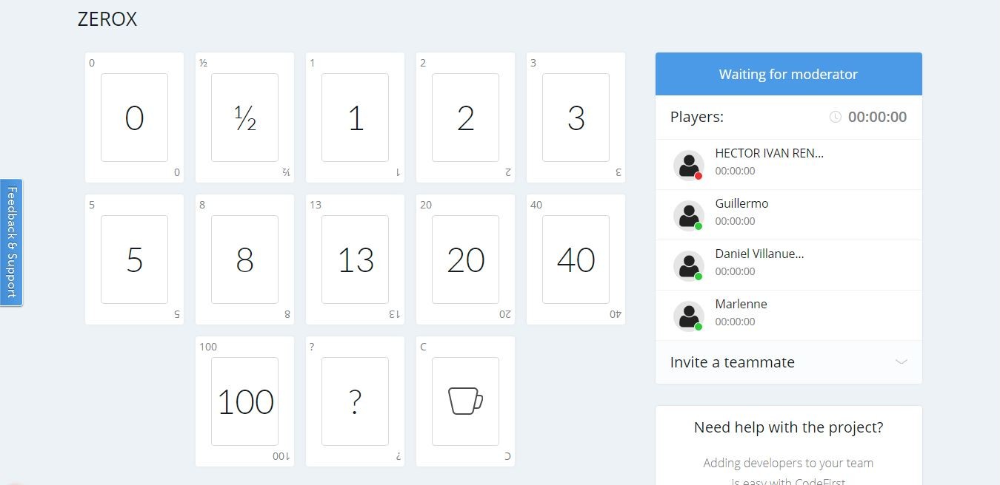

# Project start

## :trophy: A3.2 Classroom challenge

Start phase of the SCRUM framework for the case study.

### :blue_book: Instructions

- Based on research and the document provided by the consultant, perform project documentation using the scrum framework for the case study.
- The activity must be carried out using a platform such as **Notion**, or **Confluence**, and must be sent in PDF style, naming it with the nomenclature **A3.2_ActivityName_StudentName.pdf.**.
- Your repository, in addition to having a **readme**.md file in its root directory, with information such as student data, work team, subject, career, advisor data, and even logo or images, must have a contents section or index.

### :pencil2: Development

1. Join your work team and start preparing the following requests:
   - [x] 1.1 Create scrum board with the columns Backlog, Story, To-do, Doing, Review, Done.
   - [x] 1.2 Develop product backlog Epics.
   - [x] 1.3 Develop user stories for each epic.
   - [x] 1.4 Place each epic and user story within the scrum board.
   - [x] 1.5 Prioritize and estimate each user story using a tool.
 
 [Scrum Product Backlog](../PDF/A3.2-Fase-inicio-Artefactos.pdf)
 
2. Present this information during the planning meeting, making use of visual and graphic tools, which can be through any online platform.

3. Place in this section evidence that shows that you came together to develop the activity as a team.

## Conclusions 

*  **Renteria Sanchez Hector Ivan:** At the end of the work we were able to conclude the product backlog, some things were complicated for us such as how to prioritize user stories according to their level of importance, but with the example shown in class and separately talking about it with each of the team members We managed to complete the activity, something that helped us to better understand was the tool that the advisor provided us to be able to assign a correct estimation level.
  
*  **Rodríguez Báez Vanessa Marlenne:** In this practice we made a scrum method board where we made the epics, user stories, acceptance criteria, priority, dependencies, Sprint and states of our knowledge search project, which in the whole team we concluded to make between 32 user stories and 8 epics, which as a team and on the page used in class we concluded the estimation of each story, What was quite complicated was the realization of the user stories because we did not know or we were not very clear how to make them and how to divide them, once we came to agree all flowed but the realization of the stories and everything else that asked the practice, in this practice I learned how to divide and manage a project by the scrum method.
  
*  **Soria Márquez Guillermo:** In this practice we made a scrum board where we had to put epics, user stories, acceptance criteria, priority, dependencies, sprin and states. Thanks to past classes I already had a notion of the agile scrum methodology and many of the concepts were not complicated when the teacher explained them to us; but at the moment of applying them in the practice we had problems with the user stories, more than anything in how to accommodate the epics with the respective stories. Another point was the estimation because we had no idea how to formulate them; we used an estimation page based on the knowledge and skills of each one of the team members to get an average which would be the estimation. Other than that we didn't have any problems.
  
*  **Villanueva Mercado Daniel Alejandro:** This is an activity that made us think a lot, because normally I'm more used to think about user stories, not epics as such. So in order to do this activity we first had to think a bit about the user stories to see how the epics would be, but once we had a clear idea of what we should put, it was easier. But the most complicated part was to be able to give an accurate estimation of what each one believed with each user story, even so, the activity as such was not complicated to perform.

### :bomb: Rubric

| Criteria     | Description                                                                                  | Score |
| ------------- | -------------------------------------------------------------------------------------------- | ------- |
| Instructions | Each of the points indicated in the section "The company complies with each one of the following points Instructions?            | 10      |  
| Development    | Each of the points requested in the development of the activity was answered.?     | 60      |
| Demonstration  | The student introduces himself during the explanation of the functionality of the activity.?            | 20      |
| Conclusions  | A personal opinion of the activity is included for each team member.? | 10      |

:house: [Link Renteria Sanchez Hector Ivan](https://github.com/IvanRenteria/Analisis-Avanzado-de-Software)

:house: [Link Rodríguez Báez Vanessa Marlenne](https://github.com/vanessamRodriguez/Analisis-Avanzado-de-Software)

:house: [Link Soria Márquez Guillermo](https://github.com/GuillermoSoria97/Analisis_Avanzado_de_Software)

:house: [Link Villanueva Mercado Daniel Alejandro](https://github.com/Dany305/Analisis-Avanzado-de-Software)