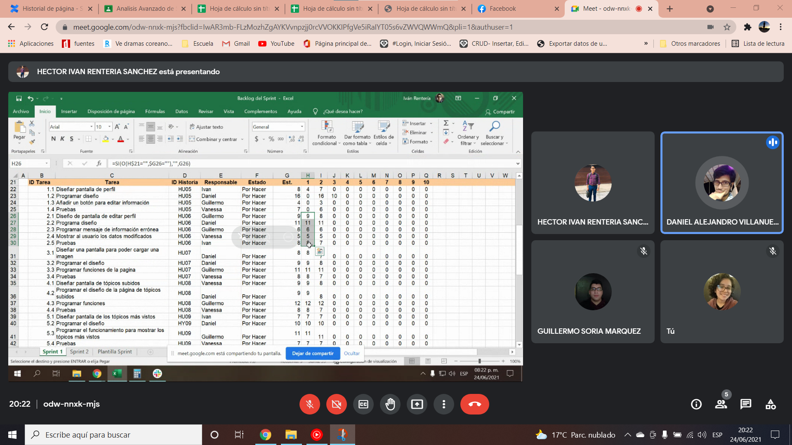

# Introduction

## :trophy: A3.4 Learning activity

Project documentation using the Scrum framework for the planning and estimation phase.

### :blue_book: Instructions

- Based on research and the document provided by the consultant, perform project documentation using the scrum framework for the case study.
- The activity must be carried out using a platform such as **Notion**, or **Confluence**, and must be sent in PDF style, naming it with the nomenclature **A3.4_ActivityName_StudentName.pdf.**.
- Your repository, in addition to having a **readme**.md file in its root directory, with information such as student data, work team, subject, career, advisor data, and even logo or images, must have a contents section or index.
  
## :pencil2: Development

1. Join your team and start preparing what is requested below:
   - [x] 1.1 Identify the tasks for each user story.
   - [x] 1.2 Estimate tasks using a digital tool.
   - [x] 1.3 Create the Sprint backlog with the estimated tasks in hours.
   - [x] 1.4 Develop your gantt chart.
   - [x] 1.5 Identify dependencies of each task and relate it to the activity it depends upon.
   - [x] 1.6 Elaborate Burn down chart the sprint one.

[Backlog Sprint 1, Diagram of Gantt](https://github.com/vanessamRodriguez/Analisis-Avanzado-de-Software/blob/main/PDF/ANALISIS-Sprintbacklog-260621-0339.pdf)

2. Present this information using visual and graphical tools within the sprint planning meeting.
3. Place a section with evidence to show that you came together to develop the activity as a team..

## Conclusions 
*  **Renteria Sanchez Hector Ivan:** During the development of this last work we met with time as a team to carry out the development of the tasks, for this we had no major inconvenience because the tasks we carried out were clear to everyone, the sprint backlog was completed and apart we met again to estimate each task that had been documented, in this part we only had a confusion due to the issue of how many hours we would be assigning to each task, but clarifying the doubts among all was when we continued estimating the others, the last problem was to develop it in Excel because the hours had to coincide with the hours that everyone should be working per day and not leave anyone without working, so if we dedicate more time to this part but after a while we complete all the tasks so that the majority are always working in a important task without being dependent on others.
*  **Rodríguez Báez Vanessa Marlenne:** In this practice we developed the first sprint backlog we divided the user stories, we met to establish the hours of each story and to establish the tasks that each one would do in the day, we concluded that our project will be done between 13 or 15 days the first sprint 13 days if we all work what corresponds to us or 15 days at the most of work, As a team we organized ourselves and established the tasks of each one depending on what they are good at. This practice helps us to know how to plan a sprint backlog for a project, which I know that in the future I will be able to apply it.
*  **Soria Márquez Guillermo:**  In this practice we used concepts from previous practices, it was only to
expand a little more the use of the agile scrum methodology; we simulated the first sprint and assigned
tasks to the user stories made previously, in the same way we used an online platform to make the
estimates but in this case in hours. The complicated part of this activity was to make the Burn down
chart of the sprint since we had to divide the tasks among the team members so that it was done in the
time we proposed and that each member covers the eight working hours per day. It was tedious since
everything had to fit in the end but other than that there were no other problems
*  **Villanueva Mercado Daniel Alejandro:** This activity despite being divided into several parts, each of
them are related in one way or another, so in order to move forward it was necessary to prioritize
others so that the others are easy to do. One thing I learned in this activity is that when designating
each sprint it is better to keep in mind that each user story will be divided into small tasks to make it
easier to move forward in each task. And therefore we must contemplate the time that each task could
take and that the sprint should not be too short. In this way we take care of the quality of the program
and save the time that would be invested to correct errors, which if they had been done well would not
have to be presented.

  
#### :bomb: Rubric

| Criteria     | Description                                                                                  | Score |
| ------------- | -------------------------------------------------------------------------------------------- | ------- |
| Instructions | Each of the points indicated in the section "The company complies with each one of the following points Instructions?            | 10      |  
| Development    | Each of the points requested in the development of the activity was answered.?     | 60      |
| Demonstration  | The student introduces himself during the explanation of the functionality of the activity.?            | 20      |
| Conclusions  | A personal opinion of the activity is included for each team member.? | 10      |

:house: [Link Renteria Sanchez Hector Ivan](https://github.com/IvanRenteria/Analisis-Avanzado-de-Software)

:house: [Link Rodríguez Báez Vanessa Marlenne](https://github.com/vanessamRodriguez/Analisis-Avanzado-de-Software)

:house: [Link Soria Márquez Guillermo](https://github.com/GuillermoSoria97/Analisis_Avanzado_de_Software)

:house: [Link Villanueva Mercado Daniel Alejandro](https://github.com/Dany305/Analisis-Avanzado-de-Software)